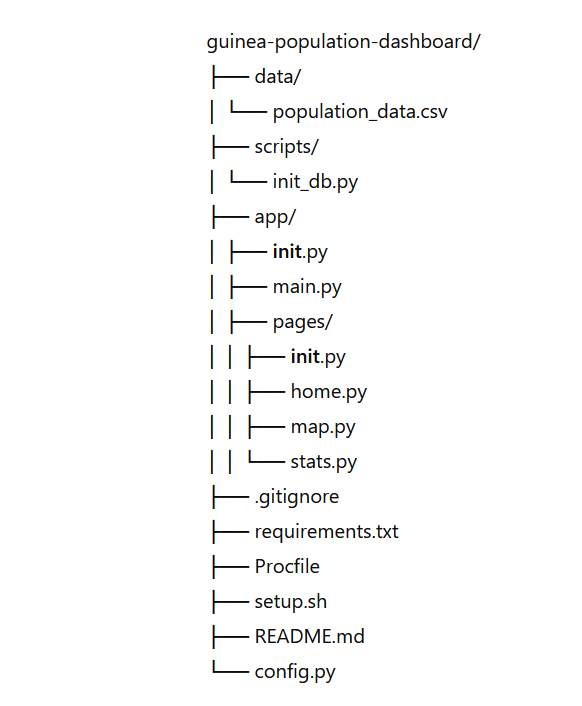

# Tableau de Bord de la Population de Guinée

Ce projet est un tableau de bord de visualisation de données complet pour les statistiques de la population de la Guinée. Construit en utilisant PostgreSQL, Streamlit et déployé sur Heroku, ce tableau de bord offre des visualisations perspicaces et des éléments interactifs pour explorer les tendances démographiques et la répartition de la population dans les différentes régions de la Guinée.

## Fonctionnalités

- **Carte Interactive** : Visualisez la répartition de la population à travers la Guinée avec une carte interactive.
- **Statistiques de Population** : Consultez des statistiques détaillées de la population pour chaque région.
- **Tendances Migratoires** : Analysez les tendances migratoires et les changements de population au fil des ans.
- **Design Réactif** : Accessible sur différents appareils avec une interface conviviale.

## Technologies Utilisées

- **PostgreSQL** : Système de gestion de base de données pour stocker et gérer les données de population.
- **Streamlit** : Cadre pour créer des applications web interactives de visualisation de données.
- **Heroku** : Plateforme cloud pour déployer et héberger l'application.

## Installation et Déploiement

1. **Clonez le dépôt :**

    ```bash
    git clone hhttps://github.com/Santoudllo/guinea-population-dashboard.git
    ```

2. **Installez les dépendances :**

    ```bash
    pip install -r requirements.txt
    ```

3. **Configurez la base de données PostgreSQL :**

    ```bash
    # Créez la base de données et les tables nécessaires
    # Insérez les données de population
    ```

4. **Lancez l'application Streamlit :**

    ```bash
    streamlit run app.py
    ```

5. **Déployez sur Heroku :**

    ```bash
    heroku create guinea-population-dashboard
    heroku addons:create heroku-postgresql:hobby-dev
    git push heroku main
    ```

## Arborescence du Projet




## Détails des dossiers et fichiers

- **data/** : Ce dossier contient les fichiers de données brutes.
    - `population_data.csv` : Fichier CSV contenant les données de population de la Guinée.

- **scripts/** : Ce dossier contient les scripts de gestion de la base de données.
    - `init_db.py` : Script pour initialiser et peupler la base de données PostgreSQL.

- **app/** : Ce dossier contient l'application principale Streamlit.
    - `__init__.py` : Fichier pour marquer ce répertoire comme un module Python.
    - `main.py` : Fichier principal de l'application Streamlit.
    - **pages/** : Ce sous-dossier contient les différentes pages de l'application Streamlit.
        - `__init__.py` : Fichier pour marquer ce répertoire comme un module Python.
        - `home.py` : Page d'accueil de l'application.
        - `map.py` : Page contenant la carte interactive.
        - `stats.py` : Page contenant les statistiques de population.

- **.gitignore** : Fichier pour spécifier les fichiers et dossiers à ignorer par Git.

- **requirements.txt** : Fichier listant les dépendances Python nécessaires.

- **Procfile** : Fichier utilisé par Heroku pour démarrer l'application.

- **setup.sh** : Script pour les configurations initiales nécessaires pour déployer sur Heroku.

- **README.md** : Documentation du projet (le fichier que nous avons précédemment créé).

- **config.py** : Fichier pour gérer les configurations de l'application, telles que les paramètres de connexion à la base de données.
